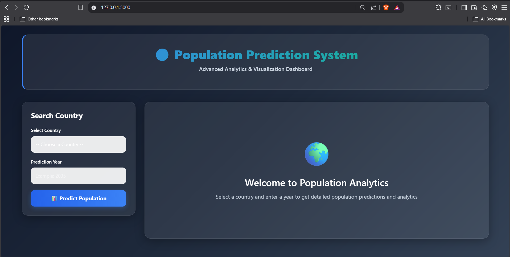
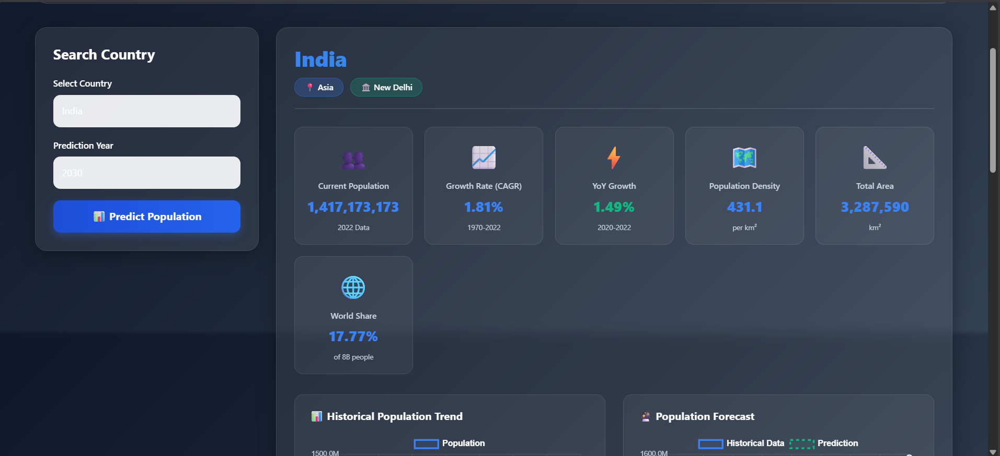
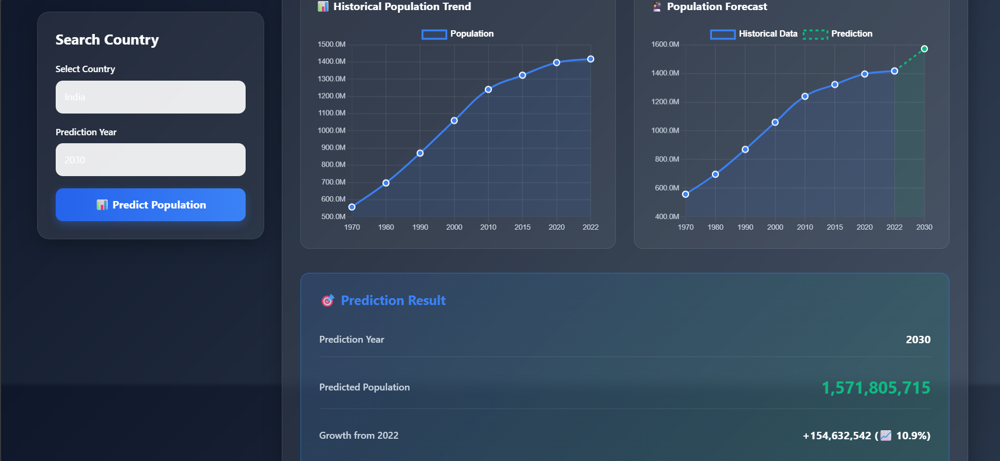
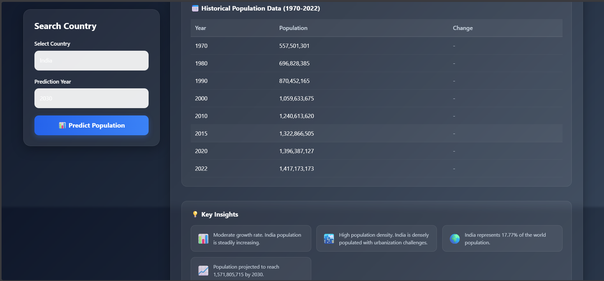
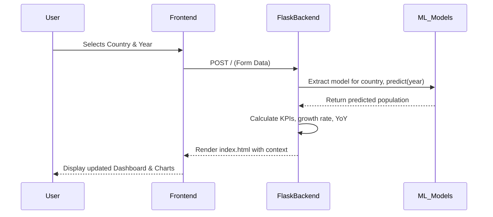

<div align="center">

# 🌍 Population Prediction System

[](https://www.python.org/)
[](https://flask.palletsprojects.com/)
[](https://scikit-learn.org/)
[](https://getbootstrap.com/)
[](https://www.chartjs.org/)

A machine learning web application that predicts and visualizes global population trends. It leverages historical data to generate accurate future population forecasts and presents the data through an interactive, beautiful dashboard.

</div>

---

## 📖 Overview

The **Population Prediction System** allows users to select from over 230 countries and territories to visualize their historical population growth and predict future population sizes. Using Polynomial Regression trained on historical population data spanning from 1970 to 2022, the system effectively captures and extrapolates demographic trends into the future.

### Main Use Cases
- Forecasting a specific country's population for a future year (e.g., 2050).
- Analyzing historical population data and Year-over-Year (YoY) growth.
- Comparing population densities, global share, and demographic insights.

### Target Users
- Researchers and demographers.
- Students and data science enthusiasts.
- Planners and policymakers.

---

## 📸 Screenshots

### Main Dashboard


### Key Performance Indicators (KPIs)


### Visualizations


### Key Insights


---

## 💻 Tech Stack

### Frontend Technologies
- **HTML5 & CSS3**: Core structure and custom styling.
- **Bootstrap 5.3.0**: Responsive layout and utility classes.
- **Chart.js**: Interactive data visualization (Line charts for history and forecasting).

### Backend Technologies
- **Python**: Core programming language.
- **Flask**: Web framework for routing and request handling.
- **Scikit-Learn**: Machine learning library used for `PolynomialFeatures` and `LinearRegression`.
- **Pandas**: Data manipulation and transformation.
- **Joblib**: Model serialization and deserialization.

### Data Storage & Persistence
- **Flat Files**: Utilizes static datasets (`world_population.csv`).
- **Pickle Objects**: Fast, serialized model storage (`.pkl` files) for deployed predictions.

---

## 🏗 Architecture

### High-Level Architecture
The project follows a standard MVC-like architecture. The Flask backend (`app.py`) serves as the controller, interacting with pre-trained serialized machine learning models (`population_models.pkl`) and the original dataset to generate context. The results are passed into a Jinja2 template (`index.html`) which renders the dashboard.

### Request Flow


### Folder Structure Breakdown
```text
.
├── app.py                  # Main Flask application and request router
├── train_model.py          # Data preprocessing and model training script
├── world_population.csv    # Raw population dataset (1970-2022)
├── processed_data.pkl      # Preprocessed, long-format pandas DataFrame
├── population_models.pkl   # Serialized Polynomial Regression models (per country)
├── xgboost_models.pkl      # Legacy serialized models (deprecated)
├── static/                 
│   └── style.css           # Custom dark-theme UI styling
└── templates/              
    └── index.html          # Main HTML dashboard template with Jinja2 syntax
```

### Important Design Decisions
- **Model Choice (Polynomial Regression)**: Chosen over Tree-based models (like XGBoost or Random Forest) because Tree models cannot extrapolate beyond the maximum target value seen in training data. Polynomial Regression allows for accurate continuous future forecasting.
- **Per-Country Modeling**: A unique machine learning model is trained and saved independently for each country to isolate localized demographic trends.

---

## ✨ Features

### User-Facing Features
- **Country Selector**: Dropdown selection covering 234 countries/territories.
- **Future Forecasting**: Input any year (e.g., 2035) to predict future populations.
- **Interactive Visualizations**: Dynamic line charts plotting historical data and connecting predictions.
- **KPI Metrics**: Displays current population, Compound Annual Growth Rate (CAGR), YoY growth, total area, and population density.
- **Demographic Insights**: Automated text insights summarizing demographic status based on density and growth rates.

### API Capabilities
- The Flask backend acts as a monolithic server rendering HTML templates directly to the client.

---

## 🚀 Installation

### Prerequisites
- Python 3.8 or higher.
- `pip` package manager.

### Clone Repository
```bash
git clone https://github.com/yourusername/population-prediction.git
cd population-prediction
```

### Environment Setup & Install Dependencies
Create a virtual environment (recommended) and install the necessary Python packages:
```bash
python -m venv venv
# On Windows:
venv\Scripts\activate
# On Mac/Linux:
source venv/bin/activate

# Install dependencies
pip install flask pandas scikit-learn joblib
```

### Database Setup
No explicit database setup is required. The static CSV file `world_population.csv` acts as the primary data store and is included in the root directory.

### Build Instructions
Run the model training script to process the data and generate the machine learning models.
```bash
python train_model.py
```

---

## ⚙️ Environment Variables
| Variable | Description | Required | Default |
|----------|-------------|----------|---------|
| OMP_NUM_THREADS | Sets the number of threads for OpenMP parallel regions. Set to '1' in `app.py`. | No | '1' |

---

## 🏃‍♂️ Running Locally

### Development Mode
Start the Flask application using the built-in development server:
```bash
python app.py
```
The application will be accessible at `http://127.0.0.1:5000/`.

---

## 🌐 API Documentation
### Main Interface
- **Method**: GET & POST
- **Route**: `/`
- **Description**: Renders the main dashboard HTML. If accessed via POST, it processes form data to generate predictions.
- **Request Parameters**: None.
- **Request Body (POST Form Data)**:
  - `country` (String): The name of the country/territory.
  - `year` (Integer): The target year for prediction.
- **Authentication requirements**: Open Access.

---

## 🗄 Database & Schema
- **Data Source**: Local CSV files (`world_population.csv`) and Pickle objects.
- **Schema Overview**: The dataset tracks historical populations for years: 1970, 1980, 1990, 2000, 2010, 2015, 2020, and 2022, along with area, density, and global demographic statistics.

---

## 📜 Scripts
| Script | Purpose |
|--------|---------|
| `python train_model.py` | Transforms wide-format demographic data to long-format, saves `processed_data.pkl`, and trains per-country Polynomial Regression models saved to `population_models.pkl`. |
| `python app.py` | Starts the Flask development server on port 5000. |

---

## 🚢 Deployment
### Production Deployment Steps
1. Provision a web server (e.g., Heroku, Render, AWS, or DigitalOcean).
2. Set up a WSGI production server such as `gunicorn`.
3. Start the application:
```bash
gunicorn app:app
```

---

## 🛡 Security
- **Security Considerations**: Ensure Flask's `debug=True` mode is disabled in production to prevent arbitrary code execution and information disclosure. 

---

## 🔧 Troubleshooting
### Common Issues
- **`ModuleNotFoundError`**: Ensure your virtual environment is active and you have run `pip install flask pandas scikit-learn joblib`.
- **`FileNotFoundError: population_models.pkl`**: Ensure you have run `python train_model.py` at least once before starting the application.

---

## 🤝 Contributing
Contributions are welcome!
1. Fork the repository.
2. Create a feature branch (`git checkout -b feature/AmazingFeature`).
3. Commit your changes (`git commit -m 'Add some AmazingFeature'`).
4. Push to the branch (`git push origin feature/AmazingFeature`).
5. Open a Pull Request.

---

## 📄 License
Distributed under the MIT License. See `LICENSE` for more information.

---

## 🔮 Future Improvements
- **RESTful API Endpoint**: Extract the logic from the monolithic route into a `/api/predict` JSON endpoint.
- **Cloud Database**: Migrate the CSV and Pickle files to a managed database (e.g., PostgreSQL).
- **Dockerization**: Create a `Dockerfile` for easier deployment.
- **Unit Testing**: Implement `pytest` for automated test coverage.
